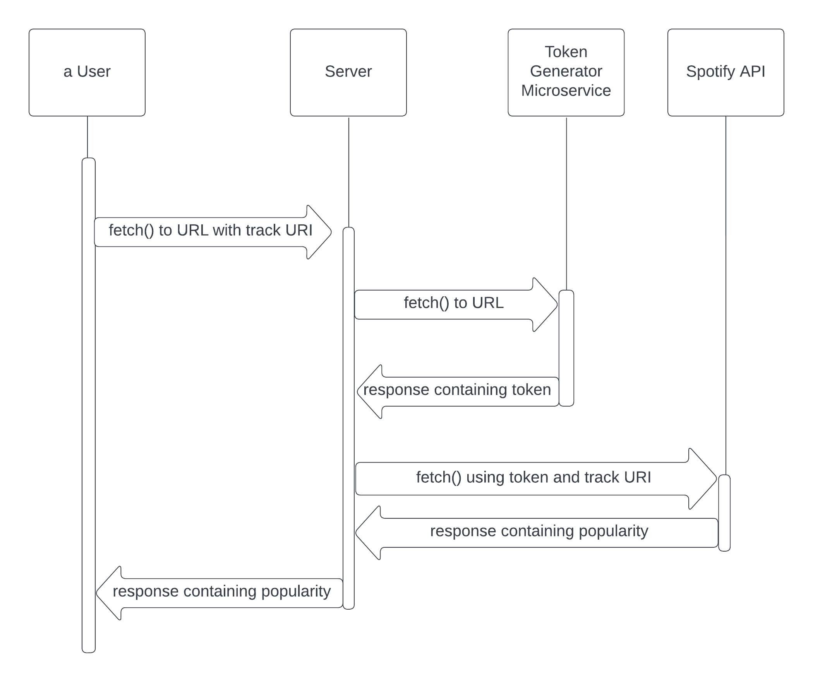

# Spotify Track Popularity Microservice
This app provides a REST route to easily request and receive a track's popularity on Spotify. Currently only supports using Spotify's URI for the track. 

## Making a Request
Use the microservice by sending a `GET` request to 

`https://spotify-track-popularity.herokuapp.com/track-uri/[insert track uri here]`,
 
where the portion in brackets will be replaced with the track's URI. 

Here is an example call using the Javascript `fetch` API: 

```
fetch('https://spotify-track-popularity.herokuapp.com/track-uri/2tdNI4jmNQkOT41LSTSA17')
```

## Parsing the Response
If successful, the response body should include the popularity of the track on a scale of 0 to 100 according to Spotify's algorithm. This may be accessed using Javascript's Promise API. 

The following is an example Node.js app calling this API. On success, the song's popularity will be printed to the console.

```
const fetch = require('node-fetch');

fetch('https://spotify-track-popularity.herokuapp.com/track-uri/2tdNI4jmNQkOT41LSTSA17')
.then(res => res.text())
.then(res => console.log(res))
.catch(err => console.error(err));
```

## UMI Diagram
